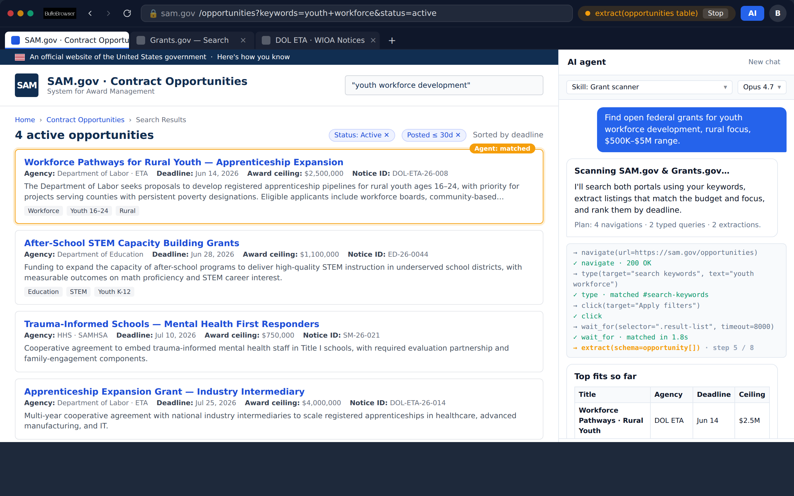
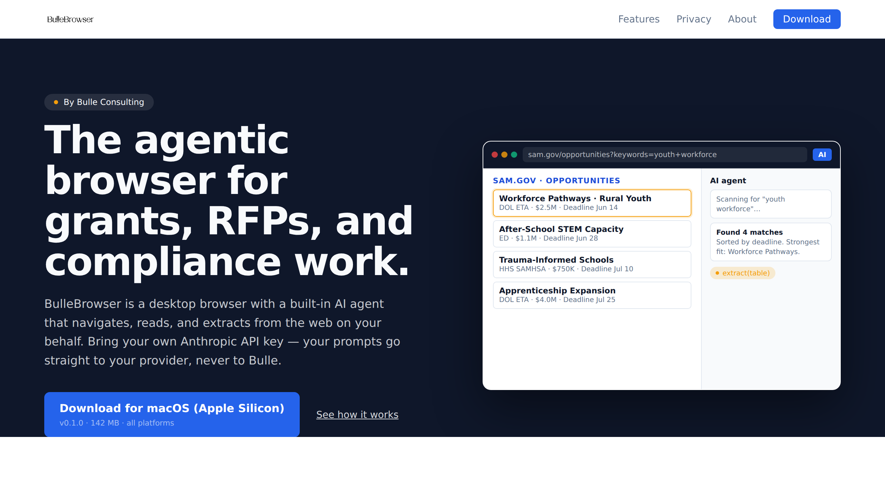

# BulleBrowser — UI screenshots

These screenshots are rendered from the actual brand tokens, color
palette, typography, and component layout shipping in this repo. They
are 2× DPR (retina) renders so they stay crisp at any embedding size.

## `desktop-grant-scanner.png`

The desktop application mid-task: the **Grant Scanner** preset skill is
running against SAM.gov in the active tab while the AI panel on the
right shows the user prompt, the agent's plan, a live tool-call
activity feed (`navigate → type → click → wait_for → extract`), and an
in-progress results table. The orange "Agent is working" pill with the
Stop button lives in the top bar; the AI panel toggle, profile menu,
tabs, address bar, and back/forward/reload controls are all visible.

## `landing-hero.png`

The bullebrowser.com home page hero: the OS-aware download CTA pulls
the latest GitHub Release for the visitor's platform; the right-hand
preview is a compact mockup of the same agent flow shown in the
desktop screenshot.

## How these were generated

`docs/screenshots/regenerate.md` documents how to re-shoot these from
HTML mockups using headless Chromium, in case the brand tokens or
component layouts change.
